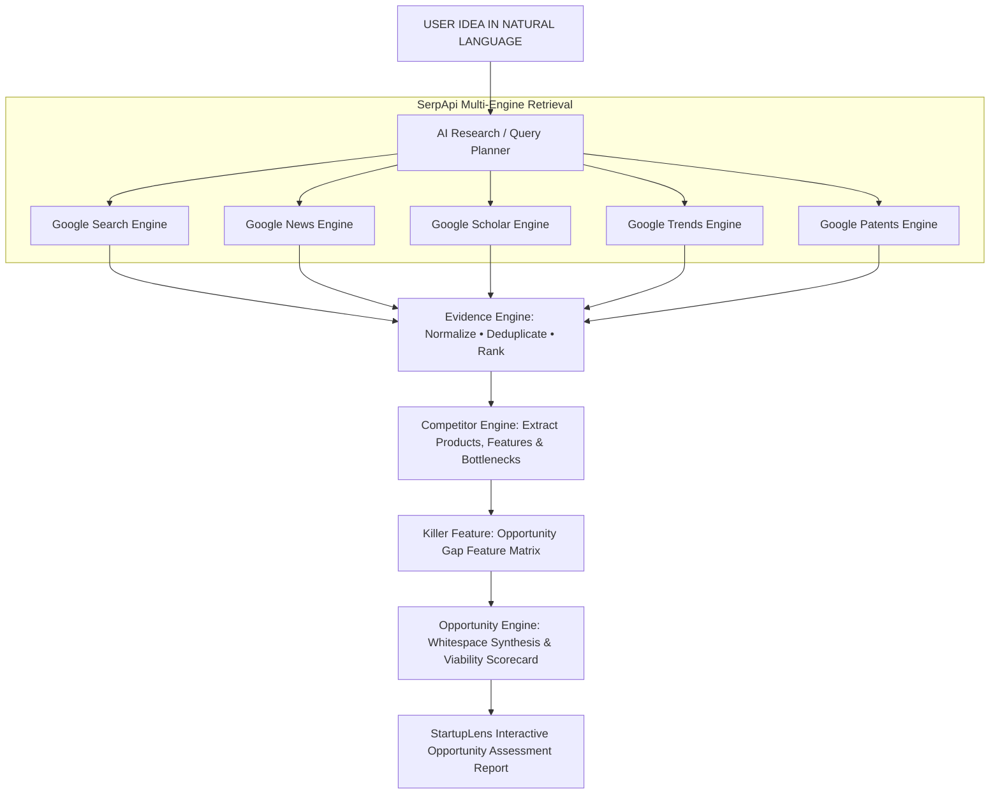

# 🚀 StartupLens

> **SerpApi Hackathon 2026 — Track 5: Idea Validation & Opportunity Discovery**  
> Evidence-backed opportunity assessment engine powered by multi-engine SerpApi live research.

---

## 🎯 The Core Thesis

Most idea validation tools ask:  
> *"Is my idea already built?"*

**StartupLens asks:**  
> *"What already exists, what is missing, and what new opportunity can I build?"*

When an entrepreneur enters a concept—such as *“AI attendance system for rural schools”*—StartupLens does not just return a list of links. It orchestrates **SerpApi** across 5 distinct Google engines, normalizes the evidence, extracts incumbent capabilities into a feature matrix, and uncovers the unaddressed whitespace to recommend your defensible differentiation wedge:

> **Example Opportunity:** *“Build an offline-first, privacy-focused attendance system specifically for low-connectivity rural schools. Incumbents (Verkada, Hikvision) require continuous 1Gbps internet and expensive $1,500/yr licenses. By running lightweight quantized models on sub-$50 tablets with asynchronous mesh sync, you win where legacy systems fail.”*

---

## 🌐 SerpApi Multi-Engine Knowledge Retrieval

| SerpApi Engine | Role in StartupLens | Hackathon Priority | Evidence Extracted |
|---|---|---|---|
| **Google Search** (`google`) | Existing products & commercial competitors | **MUST** | Incumbent products, pricing tiers, feature lists, target markets |
| **Google News** (`google_news`) | Market developments & emerging problems | **MUST** | Regulatory pushback, public friction, recent funding, infrastructure challenges |
| **Google Scholar** (`google_scholar`) | Academic research & technical feasibility | **MUST** | Edge model compression papers, offline algorithms, citation counts |
| **Google Trends** (`google_trends`) | Search demand velocity & related topics | **MUST** | 12-month interest trajectory, breakout search queries, rising topics |
| **Google Patents** (`google_patents`) | Technology & IP landscape signals | **INTEGRATED** | Discovered patent claims, assignees, filing dates, prior art clusters |

---

## ⚡ The Killer Feature: Opportunity Gap Engine

Instead of merely summarizing competitors in text, StartupLens generates an interactive **Competitor Capability Matrix**:

| Feature / Capability | Verkada | SmartSchool | Hikvision | Your Startup Idea (StartupLens) |
|---|:---:|:---:|:---:|:---:|
| **Offline-First Operation** | ✗ | ✗ | ■ | **✓ (Native)** |
| **On-Device Biometric Privacy** | ■ | ✗ | ■ | **✓ (Native)** |
| **Sub-$50 Hardware Barrier** | ✗ | ■ | ✗ | **✓ (Native)** |
| **Rural / Low-Connectivity Focus** | ✗ | ✗ | ✗ | **✓ (Native)** |
| **Local Dialect & Multilingual UI** | ■ | ✗ | ✗ | **✓ (Native)** |
| **Solar / Intermittent Power Tolerant** | ✗ | ✗ | ■ | **✓ (Native)** |

> **Result:** The system converts missing incumbent capabilities (`✗` and `■`) into your startup's core opportunity gap!

---

## 🏗️ Architecture & Workflow



---

## 🛠️ Tech Stack

- **Backend:** Python 3.12 + FastAPI + Uvicorn + Pydantic
- **Search Retrieval:** SerpApi (`httpx` asynchronous client + `google-search-results`)
- **Frontend:** React 19 + Vite + Modern Vanilla CSS Design Tokens (Glassmorphism, Dark Mode)
- **Icons & Data Visualization:** Lucide React, Custom SVG Timeseries Charts
- **Persistence & Keys:** Dynamic UI key configuration + `.env` + local storage

---

## 🚀 Getting Started

### 1. Clone & Setup Backend
```bash
cd backend
python -m venv venv
.\venv\Scripts\activate   # On Windows
pip install -r requirements.txt
```

### 2. Configure Environment (Optional)
Create `.env` in `backend/`:
```env
SERPAPI_API_KEY=your_serpapi_key_here
```
> *Note: If no API key is supplied, StartupLens runs in high-fidelity demo intelligence mode with realistic datasets so evaluators and judges can test immediately!*

### 3. Run the Backend Server
```bash
uvicorn app.main:app --host 127.0.0.1 --port 8000 --reload
```
API Documentation is available at: `http://127.0.0.1:8000/docs`

### 4. Run the Frontend
```bash
cd ../frontend
npm install
npm run dev
```
Open your browser at: **`http://localhost:5173`**

---

## 🎙️ Recommended Judge Pitch

> *“StartupLens is an evidence intelligence platform that transforms a startup idea into a structured opportunity assessment. It triangulates the idea across existing products, academic research, current news and market-interest signals using SerpApi, then uses AI to identify competitor gaps and recommend how the idea could be differentiated.”*

**Closing line:**  
> *“We don't just ask whether an idea already exists. We investigate what exists, what's changing, what people are researching and where the gaps are—then turn those signals into a potential opportunity.”*

---

## ⚖️ Legal & Ethical Disclaimers
1. **Evidence-Based Assessment:** StartupLens provides opportunity signals and architectural differentiation paths; it does not guarantee commercial success or investment outcomes.
2. **Patent Intelligence Caution:** Patent results retrieved via Google Patents are high-level technological discovery signals, not formal legal clearance, novelty verification, or freedom-to-operate advice.
